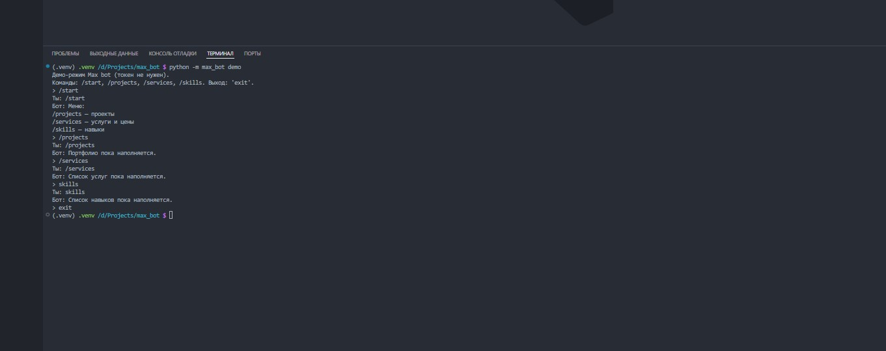

# Max Bot — портфолио-бот для мессенджера MAX

Бот показывает портфолио разработчика прямо в мессенджере: проекты со скриншотами, услуги с вилкой цен, навыки. Кроме бота в проекте — REST API для контента и демо-режим в терминале, который работает без токена.

Проект сделан как пример современного Python-бэкенда: асинхронный FastAPI + SQLAlchemy 2.0, миграции Alembic, бизнес-логика в сервисах, паттерн адаптер для API мессенджера, тесты на все слои.

## Демо

## Команды бота

    | Команда | Что делает |
    |----------------------|
    | `/start` | приветствие и меню |
    | `/projects` | опубликованные проекты |
    | `/services` | услуги и цены |
    | `/skills` | навыки |

Неизвестные команды получают вежливый ответ с меню. Забаненные пользователи игнорируются.

## REST API

    | Эндпоинт | Описание |
    |---------------------|
    | `GET /health` | жив ли сервер |
    | `GET /projects/` | список опубликованных проектов |
    | `GET /projects/{id}` | проект со скриншотами |
    | `GET /skills` | навыки |
    | `GET /services` | услуги |

Интерактивная документация — `http://127.0.0.1:8000/docs` (Swagger).

## Стек

- Python 3.13, asyncio
- FastAPI, Pydantic v2, pydantic-settings
- SQLAlchemy 2.0 (async) + Alembic, SQLite (dev)
- httpx — клиент MAX Bot API
- loguru — логирование
- pytest + pytest-asyncio, ruff

## Архитектура

Бот построен на паттерне адаптер: обработчики команд не зависят от того, куда отправляются сообщения. В `max_api` два взаимозаменяемых клиента — `FakeMaxClient` (тесты и демо) и `RealMaxClient` (продакшен). Переключение — настройкой `MAX_MODE` в `.env`.

    Пользователь MAX → MAX Bot API → bot/handlers → services → db (SQLAlchemy)
                                 ↑
                       max_api (fake/real клиент)
    REST API (FastAPI) → services → db

## Структура проекта

    src/max_bot/
    ├── api/       # REST-эндпоинты и Pydantic-схемы
    ├── bot/       # обработчики команд, демо-режим
    ├── core/      # конфиг, логирование
    ├── db/        # модели и сессии SQLAlchemy
    ├── max_api/   # клиенты MAX: реальный и фейковый
    ├── services/  # бизнес-логика
    └── main.py    # сборка FastAPI

## Запуск

    # окружение
    python -m venv .venv
    source .venv/Scripts/activate        # Git Bash (Windows)
    pip install -r requirements.txt
    pip install -e .

    # база данных
    alembic upgrade head

    # демо-чат в терминале (токен не нужен)
    python -m max_bot demo

    # API-сервер
    python -m max_bot.main

    # тесты и линтер
    pytest -q
    ruff check src tests

## Подключение реального токена MAX

1. Создай бота в MAX и получи токен.
2. Создай `.env` из `.env.example`, впиши `BOT_TOKEN` и поставь `MAX_MODE=real`.
3. `RealMaxClient` уже реализован в `max_api/client.py`; эндпоинты описаны по публичному описанию MAX Bot API — перед включением сверь поля с официальной документацией.

## Roadmap

- [ ] long-polling цикл для продакшена
- [ ] веб-админка для контента
- [ ] Docker и деплой
